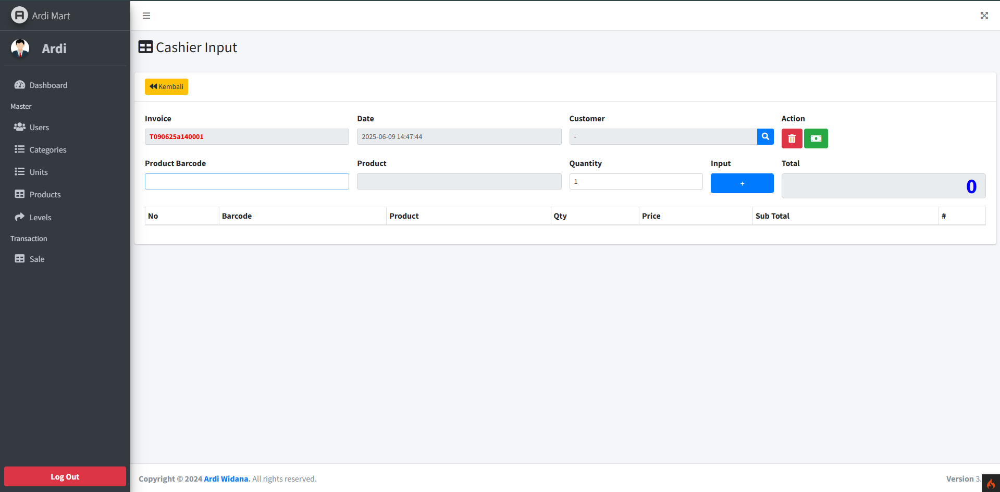

# 🛒 Ardi-Mart - Web POS System (CodeIgniter 4)

Ardi-Mart is a modern Point of Sale (POS) web application built using **CodeIgniter 4**. It features a complete management system for sales transactions, users, products, categories, units, and levels with a simple and intuitive interface.

---

## 📸 Preview



> Screenshot of the **Cashier Input** page where users can add products using barcodes, manage quantities, and finalize transactions.

---

## 🚀 Features

- 🧾 Cashier input with invoice and product barcode
- 📦 Product and stock management
- 🧍 User and level management
- 📂 Category and unit organization
- 🔐 Secure login/logout system
- 🗃️ Transaction record keeping

---

## ⚙️ Built With

- [CodeIgniter 4](https://codeigniter.com/)
- PHP 7.4+
- MySQL
- Bootstrap 5
- jQuery & DataTables

---

## 🛠️ Installation

1. Clone the repository:
   ```bash
   git clone https://github.com/yourusername/ardi-mart.git
   cd ardi-mart
2. Install dependencies via Composer:
    ```bash
    composer install

3. Configure your .env file:
    ```bash
    cp env .env
    php spark key:generate

4. Set your base URL and database credentials in .env.
   
6. Run database migrations and seeders if available:
    ```bash
    php spark migrate
    php spark db:seed LevelSeeder
    php spark db:seed UserSeeder

7. Serve the application:
    ```bash
    php spark serve

| Role    | Username | Password |
| ------- | -------- | -------- |
| Admin   | admin    | admin    |
| Cashier | cashier  | cashier  |

/app
/public
/writable
/tests
.env
composer.json

This project is licensed under the MIT License. See the LICENSE file for details.
Developed by Ardi Widana
📧 Contact: ardiwidana.gg@gmail.com
